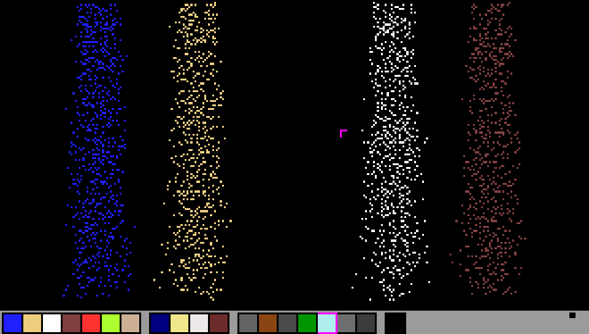

SDL2Sand
-----------------

SDL2Sand is another implementation of the now-classic Falling Sand Game, old-school and minimalistic. The game simulates different particles (such as sand, water, oil or fire) interacting with each other. Freedom is given to the player to experiment with different materials in a sandbox environment.

SDL2Sand is based on [sdlsand](http://sourceforge.net/projects/sdlsand) by T.R. Sidor and K. Jensen. While—for now—the core gameplay stayed exactly the same, the game was ported to SDL2 and optimized to run on PlayStation Vita with better looks and performances. In the future, more gameplay elements and code refactoring/optimization work is expected.

Controls
-----------------

| Button            | Action                                 |
| :---------------: | :------------------------------------- |
| ![cross]          | Paint with selected brush type         |
| ![circl]          | Erase                                  |
| ![squar]          | Enable/disable top emitters            |
| ![trian]          | Enable/disable precise cursor mode     |
| ![joysl]          | Move cursor                            |
| ![dpadh]          | Change brush type                      |
| ![dpadv]          | Decrease/increase pen size             |
| ![selec]/![start] | Clear screen                           |
| ![trigl]/![trigr] | Decrease/increase top emitters density |

Usage
----------------
Tap to select a brush type from the panel on the bottom part of the screen or choose one using ![dpadh].
Then draw using either ![joysl] analog stick and ![cross] or touchscreen. Use ![circl] instead of ![cross] to erase.
Use the ![trian] button to perform more accurate cursor movements. The particles falling from the top of the screen can be disabled at any moment by pressing ![squar], or decreased/increased with ![trigl]/![trigr] shoulder buttons.

Brush types (from left to right):

| Group 1 (particles) | Group 2 (emitters)        | Group 3 (solids)      | Group 4           |
| :------------------ | :------------------------ | :-------------------- | :---------------- |
| ![water] water      | ![waterspout] water spout | ![wall] wall          | ![eraser] eraser  |
| ![sand] sand        | ![sandspout] sand spout   | ![torch] torch        |                   |
| ![salt] salt        | ![saltspout] salt spout   | ![stove] stove        |                   |
| ![oil] oil          | ![oilspout] oil spout     | ![plant] plant        |                   |
| ![fire] fire        |                           | ![ice] ice            |                   |
| ![acid] acid        |                           | ![ironwall] iron wall |                   |
| ![dirt] dirt        |                           | ![void] void          |                   |

Authors
----------------
1. Thomas RenÈ Sidor (Studying computer science at the university of Copenhagen, Denmark) ([Personal homepage](http://www.mcbyte.dk))
2. Kristian Jensen (Studying computer science at Roskilde University, Denmark)
3. Artur Rojek: GCW Zero port
4. Volodymyr Atamanenko: SDL2 and PS Vita port

Acknowledgements
----------------
- [SDL](http://www.libsdl.org) - Simple DirectMedia Library
- [CCmdLine](http://www.codeproject.com/cpp/ccmdline.asp) - command line parser by Chris Losinger

Links
-----------------
- [sdlsand SourceForge](http://sourceforge.net/projects/sdlsand)
- [SDLSand: GCW Zero port](https://github.com/zear/SDLSand)
- [The original World of Sand from DOFI-BLOG](http://ishi.blog2.fc2.com/blog-entry-158.html)
- [The later version - Hell of Sand from DOFI-BLOG](http://ishi.blog2.fc2.com/blog-entry-164.html)

License
-----------------
SDL2Sand is released under GPLv2 license. See the [LICENSE](LICENSE) file for details.

[cross]: img/cross.svg "Cross"
[circl]: img/circle.svg "Circle"
[squar]: img/square.svg "Square"
[trian]: img/triangle.svg "Triangle"
[joysl]: img/joystick-left.svg "Left Joystick"
[dpadh]: img/dpad-left-right.svg "D-Pad Left/Right"
[dpadv]: img/dpad-top-down.svg "D-Pad Up/Down"
[selec]: img/dpad-select.svg "Select"
[start]: img/dpad-start.svg "Start"
[trigl]: img/trigger-left.svg "Left Trigger"
[trigr]: img/trigger-right.svg "Right Trigger"

[sand]: https://via.placeholder.com/15/EECC80/000000?text=+
[wall]: https://via.placeholder.com/15/646464/000000?text=+
[void]: https://via.placeholder.com/15/3C3C3C/000000?text=+
[ironwall]: https://via.placeholder.com/15/6E6E6E/000000?text=+
[torch]: https://via.placeholder.com/15/954513/000000?text=+
[stove]: https://via.placeholder.com/15/4A4A4A/000000?text=+
[ice]: https://via.placeholder.com/15/AFEEEE/000000?text=+
[plant]: https://via.placeholder.com/15/019601/000000?text=+
[ember]: https://via.placeholder.com/15/7F1919/000000?text=+
[rust]: https://via.placeholder.com/15/6E280A/000000?text=+

[water]: https://via.placeholder.com/15/2020FF/000000?text=+
[dirt]: https://via.placeholder.com/15/CDAF95/000000?text=+
[salt]: https://via.placeholder.com/15/FFFFFF/000000?text=+
[oil]: https://via.placeholder.com/15/804040/000000?text=+

[mud]: https://via.placeholder.com/15/8B4513/000000?text=+
[saltwater]: https://via.placeholder.com/15/4169E1/000000?text=+
[steam]: https://via.placeholder.com/15/5F9EA0/000000?text=+

[acid]: https://via.placeholder.com/15/ADFF2F/000000?text=+
[fire]: https://via.placeholder.com/15/FF3232/000000?text=+
[elec]: https://via.placeholder.com/15/FFFF00/000000?text=+

[waterspout]: https://via.placeholder.com/15/000080/000000?text=+
[sandspout]: https://via.placeholder.com/15/F0E68C/000000?text=+
[saltspout]: https://via.placeholder.com/15/EEE9E9/000000?text=+
[oilspout]: https://via.placeholder.com/15/6C2C2C/000000?text=+
[eraser]: https://via.placeholder.com/15/000000/000000?text=+